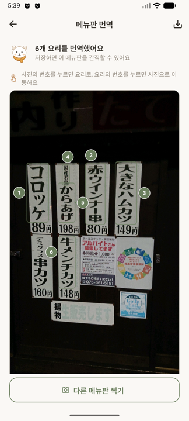
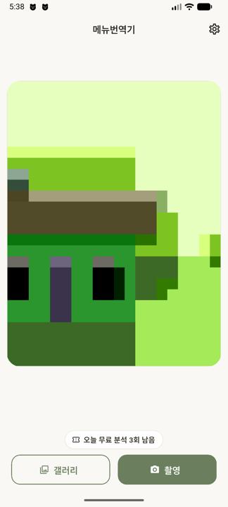
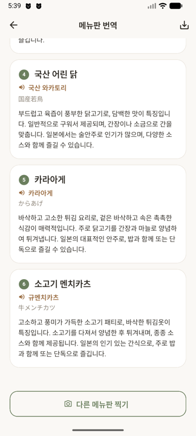
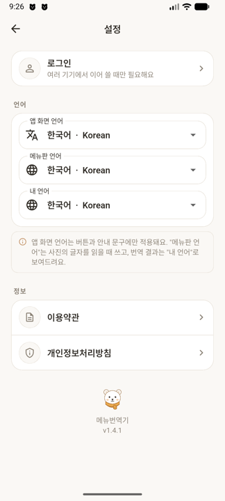

<div align="center">


# Menu Lens · 메뉴번역기

**메뉴판을 찍으면, 바로 이해됩니다.**
*Photograph a menu — understand every dish.*

한국어 · English · 日本語 · 中文 · Español

[소개 페이지](https://cheesefonduechamchi.github.io/menulens/) · [이용약관](terms-of-service.md) · [개인정보처리방침](privacy-policy.md) · [환불정책](refund-policy.md)

</div>

---

## 번역이 아니라, 설명입니다

`からあげ`를 "카라아게"라고 옮겨줘도 그게 뭔지 모르면 주문할 수 없습니다.
Menu Lens는 요리 하나하나에 대해 **네 가지**를 알려줍니다.

<div align="center">

| | |
|---|---|
| 🍱 **메뉴판 원문 그대로** | 사진에 적힌 이름과 가격 |
| 🏷️ **내 언어로 된 요리 이름** | 옮긴 말이 아니라 알아들을 수 있는 이름 |
| 🔊 **현지 발음** | 내 언어의 문자로 — 소리 내어 그대로 주문하면 됩니다 |
| 📖 **세 문장 설명** | 어떤 맛·식감인지 / 무슨 재료로 어떻게 조리하는지 / 현지에서 어떻게 먹는지 |

</div>

---

## 실제 결과 · A real example

교토의 어느 튀김집 문 앞. **일본어 메뉴판**을 **한국어**로 읽은 실제 출력입니다.

<table>
<tr><td width="42%" valign="top">



</td><td valign="top">

| 메뉴판 원문 | 가격 | 요리 이름 | 🔊 이렇게 말하세요 |
|---|---|---|---|
| 赤ウインナー串 | 89円 | **붉은 소시지 꼬치** | 아카 우인나 쿠시 |
| 大きなハムカツ | 198円 | **큰 햄카츠** | 오오키나 하무카츠 |
| コロッケ | 80円 | **크로켓** | 코로케 |
| 国産若鳥 | 149円 | **국산 어린 닭** | 코쿠산 와카토리 |
| からあげ | | **카라아게** | 카라아게 |
| 牛メンチカツ | | **소고기 멘치카츠** | 규 멘치카츠 |

> **국산 어린 닭** 🔊 코쿠산 와카토리
> 부드럽고 육즙이 풍부한 어린 닭고기입니다. 구워서 제공되며, 고소한 맛이
> 일품입니다. 일본에서는 술안주로 많이 즐기며, 다양한 소스와 함께 먹습니다.

</td></tr>
</table>

발음은 **일본어 소리를 한글로** 적습니다. `国産若鳥`은 한국 한자음 "국산약조"가
아니라 일본어 그대로 **"코쿠산 와카토리"** 입니다. 그래야 가게에서 통합니다.

---

## 사진 위에서 바로 찾기

<table>
<tr><td width="33%"></td>
<td width="33%"></td>
<td width="33%"></td></tr>
<tr><td align="center"><b>①&nbsp;찍습니다</b><br><sub>남은 무료 횟수가 아래에 보입니다</sub></td>
<td align="center"><b>②&nbsp;번호가 붙습니다</b><br><sub>번호를 누르면 그 요리 설명으로</sub></td>
<td align="center"><b>③&nbsp;설명이 도착합니다</b><br><sub>카드 번호를 누르면 사진의 그 자리로</sub></td></tr>
</table>

긴 메뉴판에서 "지금 읽는 이 설명이 사진의 어디였더라"를 잃지 않도록,
사진과 카드가 **양방향으로** 연결돼 있습니다. 번역이 다 끝날 때까지
기다리지도 않습니다 — 요리가 완성되는 대로 카드가 한 장씩 도착합니다.

---

## 메뉴판의 언어와 내 언어는 다릅니다

<table>
<tr><td width="38%"></td>
<td valign="top">

도쿄에 있는 한국인은 **일본어 메뉴판**을 **한국어로** 읽습니다.
서울에 온 외국인은 그 반대입니다. 그래서 두 가지를 따로 고릅니다.

- **메뉴판 언어** — 사진 속 글자를 어느 언어로 읽을지
- **내 언어** — 결과를 어느 언어로 받을지

**설정을 잘못 둬도 됩니다.** 고른 언어로 읽었는데 글자가 하나도 안 잡히면
서버가 다른 인식기로 **다시 읽습니다**. 메뉴판 언어가 한국어로 맞춰진 채
일본어 메뉴판을 찍어도 결과가 나옵니다.

</td></tr>
</table>

---

## 쓰는 데 필요한 것

| | |
|---|---|
| **무료** | **하루 5회** — 회원가입도, 로그인도 없이 |
| **로그인** | 여러 기기에서 이용권을 이어 쓸 때만 (Apple · Google · 카카오) |
| **사진** | 서버에 저장하지 않습니다 |

> ⚠️ 번역과 알레르기·식이 정보는 참고용입니다. 알레르기가 있다면 반드시 매장에 직접 확인하세요.

---

## 어떻게 동작하나

```
 📷 사진
  │
  ├─► OCR이 메뉴판 글자와 위치를 읽고 ──┐
  │     └ 글자가 안 잡히면 다른 언어로 다시 읽음
  │                                  ▼
  └───────────────────► 비전 LLM이 요리별로 정리 ──► 카드가 하나씩 도착 🍜
```

글자 인식은 좌표까지 돌려주기 때문에, 사진 위 번호표가 **그 요리가 실제로
인쇄된 자리**에 붙습니다. 대충 가운데 몰아놓는 게 아닙니다.

---

<div align="center">

<sub>앱 소스는 비공개입니다. 이 저장소는 소개 페이지와 법적 문서만 담고 있습니다.<br>
The app source is private; this repository hosts the public site and legal documents only.</sub>

**치퐁참 (cfc)** · 2026

</div>
